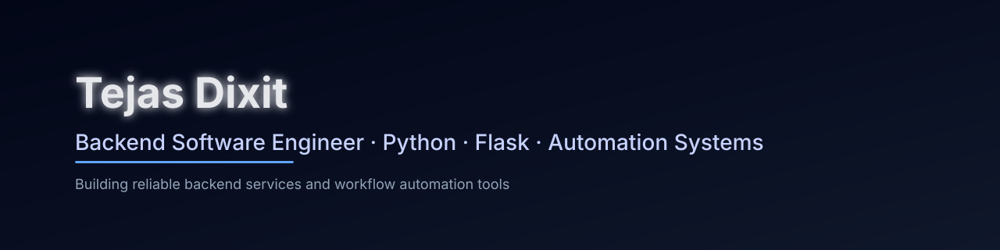

  

<h1 align="center">Tejas Dixit</h1>

  <strong>Backend Software Engineer</strong> · Python · Flask · Automation Systems

  Building backend services and workflow automation tools that improve reliability and reduce repetitive manual work.

---

## 👋 About Me

I am a **backend-focused software engineer** with hands-on experience building **Python and Flask–based backend systems** and automation tools used in real-world production workflows.

My work primarily involves **server-side development**, workflow automation, and designing systems that support content-heavy and business-driven platforms. I value **clean architecture**, separation of concerns, and maintainable code over over-engineered solutions.

I am comfortable working in **Linux-based development environments** and supporting live, client-facing applications.

---

## 🔧 What I Focus On

- Backend development using **Python & Flask**
- Workflow and editorial automation
- REST-style APIs and server-side processing
- Newsletter and HTML email generation systems
- Performance-oriented web applications
- Maintaining and supporting production systems

---

## 🚀 Featured Work

### Newsletter Workflow Automation Platform
A Python Flask–based backend automation tool for creating, previewing, and exporting **production-ready, email-safe HTML newsletters**.

🌐 Live Demo  
https://vayuveg-newsletter-platform.onrender.com/

🔗 Source Code  
https://github.com/pandatd/newsletter-workflow-automation

---

## 💼 Freelance Services

Alongside full-time work, I take up **freelance development projects** focused on backend-supported web systems.

**Services include:**
- Static and dynamic website development
- Backend integration using Python and Flask
- Website performance optimization & foundational technical SEO
- WordPress customization and maintenance
- Payment gateway integration
- Ongoing technical support for live client websites

---

## 🛠 Tech Stack

**Languages & Frameworks**
- Python
- Flask
- HTML / CSS
- SQL (SQLite, PostgreSQL)

**Tools & Environment**
- Git & GitHub
- Linux
- Markdown
- Gunicorn

**Core Strengths**
- Backend Development
- Automation
- Workflow Optimization
- Production Systems

---

## ✍️ Writing & Knowledge Sharing

I occasionally write about Python and backend development on Medium:

- https://medium.com/coddersclub

---

## 📫 Contact

- **Email:** tejasdixit17@gmail.com  
- **LinkedIn:** https://www.linkedin.com/in/tejasdixit  
- **GitHub:** https://github.com/pandatd  

---

## 📊 GitHub Stats

  

  

---

## ⭐ What This Profile Communicates

- Backend-first engineering mindset  
- Real-world automation experience  
- Production-ready systems  
- Clean, maintainable code practices  
- Live deployed applications  

---
