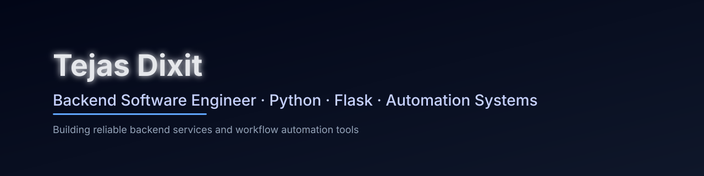

<p align="center">
  
</p>

<h1 align="center">Tejas Dixit</h1>

<p align="center"><strong>Python Backend Developer</strong> · Flask · SQL · Automation</p>

<p align="center">I build Python backend applications and automation workflows, with a focus on practical deployment, databases, testing, and maintainable code.</p>

---

## About

I am a Python-focused developer working toward junior backend engineering roles.

My strongest demonstrated areas are:
- Python and Flask backend development
- SQL and relational database fundamentals
- Production-oriented automation
- Linux-based application deployment
- Testing and code-quality tooling
- Git-based development workflows

I prefer learning by building, testing, documenting, and reviewing working code rather than collecting technology claims.

## Selected Work

### Hostel Management Application

A Flask hostel-management application with relational data modeling, CRUD workflows, authentication, password-reset handling, attendance/geofencing, and Alembic migrations.

**Evidence:** [Repository](https://github.com/PANDATD/DES-Hostel-Mangment-) · [Live application](https://des-nivas.vercel.app)

> **Status:** Active development. The deployment/migration workflow is still being improved, so I do not present this as a finished production system.

### SAJ Digital Nexus

A Flask-based website project using an application factory, Blueprints, environment-driven configuration, Pytest, Ruff, GitHub Actions CI, and Vercel deployment configuration.

**Evidence:** [Repository](https://github.com/PANDATD/saj-digital-nexus) · [Live application](https://saj-digital-nexus.vercel.app)

### VAYUVEG Newsletter Platform

A Flask-based newsletter workflow application for building, previewing, and exporting email-safe HTML newsletters.

**Evidence:** [Repository](https://github.com/PANDATD/vayuveg-newsletter-platform)

### Learning Lab

A structured, practice-driven repository where I develop Python backend engineering skills through implementation, testing, documentation, Git, and pull requests.

Current learning areas include Python, Pydantic, SQL, SQLite, database fundamentals, and backend engineering foundations.

**Evidence:** [learning-lab](https://github.com/PANDATD/learning-lab)

---

## Engineering Approach

I use a simple learning and development cycle:

```text
Understand
   ↓
Implement
   ↓
Test / Verify
   ↓
Document
   ↓
Review
   ↓
Commit
   ↓
Pull Request
```

I avoid adding abstractions or technologies simply because they are popular. I introduce them when the project or learning objective requires them.

## Tools I Currently Use

**Python / Backend**
- Python
- Flask
- SQL
- SQLite
- PostgreSQL
- Pydantic

**Testing / Quality**
- Pytest
- Ruff
- MyPy
- pre-commit

**Development**
- uv
- Git / GitHub
- Linux
- Gunicorn

Technologies such as FastAPI, Docker, and more advanced CI/CD practices are areas I am continuing to develop rather than skills I currently claim as expert-level.

## Learning Lab

My `learning-lab` repository documents the progression from Python fundamentals through Pydantic and database foundations.

The repository is intentionally a learning project, not a production application.

**[View the learning-lab →](https://github.com/PANDATD/learning-lab)**

## Current Focus

- Strengthening PostgreSQL and database migration skills
- Improving automated testing for backend applications
- Building stronger API design fundamentals
- Making deployment and configuration more reliable
- Becoming able to explain my own architectural decisions without relying on generated answers

## Links

- **Website:** https://tejasdixit.in
- **LinkedIn:** https://www.linkedin.com/in/tejasdixit
- **GitHub:** https://github.com/PANDATD
- **Writing:** https://medium.com/coddersclub